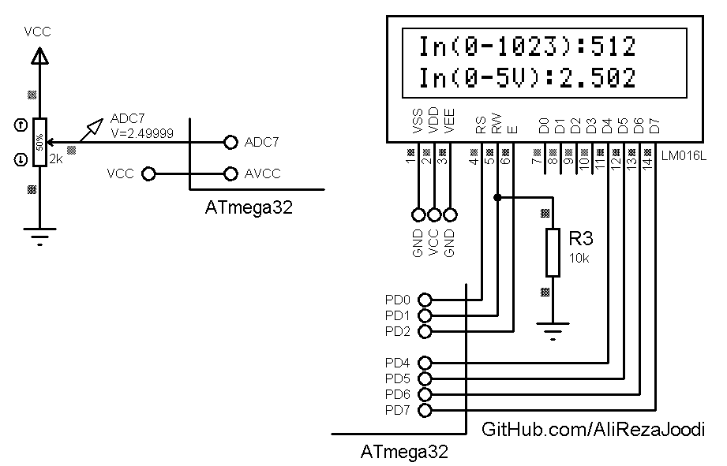

## ADC Config with AVCC VREF  
              
MCU:     	ATmega32  
Frequency:     	1.000000 MHz  
VREF:  		AVCC (5V)  
Display:        16x2 Character LCD

### Folder and Files Description
It has included:
- `Code_BascomAVR` (Code with Basic Language)
- `Code_CodeVisionAVR` (Code with C Language)
- `Simulate` (Simulator File)

### Simulate: v1.0

My GitHub Account: [GitHub.com/AliRezaJoodi](https://github.com/AliRezaJoodi)  
**Note**: [You can go here to download a single folder or file from GitHub.com](https://minhaskamal.github.io/DownGit/#/home)
