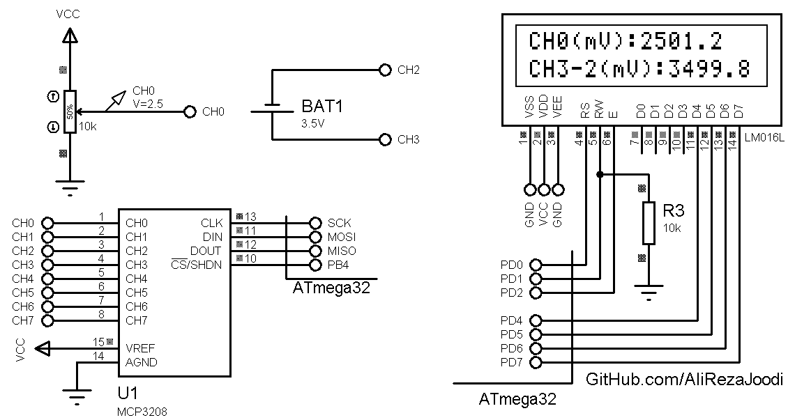

## MCP3208 External ADC With SPI Interface
              
MCU:     	ATmega32  
Frequency:     	8.000000 MHz (Internal)  
Display:        16x2 Character LCD

Note: This library is usable for MCP3201/MCP3202/MCP3204 

### Folder and Files Description
It has included:
- `Code_CodeVisionAVR` (Code with C Language)
- `Simulate` (Simulator File)

### Simulate: v1.0

My GitHub Account: [GitHub.com/AliRezaJoodi](https://github.com/AliRezaJoodi)  
**Note**: [You can go here to download a single folder or file from GitHub.com](https://minhaskamal.github.io/DownGit/#/home)
