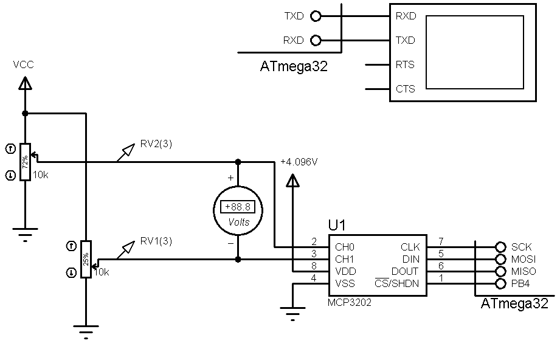

## External ADC With SPI Interface, MCP3202
Test my library from CrossPlatformLibraries.  
 
### Simulate: v1.0

            
### Features
- **MCU:** ATmega32  

### Folder and Files
- `Code_CodeVisionAVR` (Code with C Language)
- `Simulate` (Simulator File)

### Useful Links
GitHub Profile:  
[GitHub.com/AliRezaJoodi](https://github.com/AliRezaJoodi)   
Download single folder or file from GitHub:  
[https://minhaskamal.github.io/DownGit/#/home](https://minhaskamal.github.io/DownGit/#/home)  