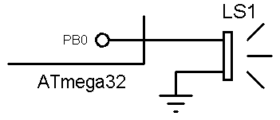

## Create a Beeb Sound with Buzzer
 
### Simulate: v1.0

 
MCU:		ATmega16A  
Frequency:   	8MHz   

### Folder and Files Description
- `Code_BascomAVR` (Code with Basic Language)
- `Code_CodeVisionAVR` (Code with C Language)
- `Code_mikroC PRO for AVR` (Code with C Language)
- `Simulate` (Simulator File)

My GitHub Account: [GitHub.com/AliRezaJoodi](https://github.com/AliRezaJoodi)  
**Note**: [You can go here to download a single folder or file from GitHub.com](https://minhaskamal.github.io/DownGit/#/home)
