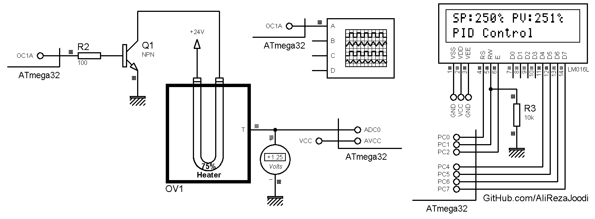

## PID Control Systems
It's a free library for PID Controller.  
It's an example to control oven temperature.

MCU:        ATmega32  
Frequency:  8.000000 MHz  
Display:    16x2 Character LCD   

Note: `ControlSystem_PID.h` is a header file for pid control system function. It usable for other uses.

### Folder and Files Description
It has included:
- `Code_CodeVisionAVR` (Code with C Language)
- `Simulate` (Simulator File)

### Simulate: v1.0

**Note**: [A good representation of PID Controllers parameters](https://www.linkedin.com/feed/update/urn:li:activity:6942502127231541248/)

My GitHub Account: [GitHub.com/AliRezaJoodi](https://github.com/AliRezaJoodi)  
**Note**: [You can go here to download a single folder or file from GitHub.com](https://minhaskamal.github.io/DownGit/#/home)
