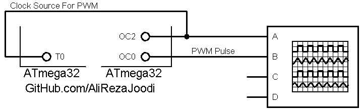

## 31.250KHz Pulse Generator With Frequency Control And PWM

MCU:       	ATmega32  
Frequency:  	16MHz (External Crystal)  
Timer2: 	CTC Mode  
Timer0:		PWM Mode With External Clock Source  

Note: The Timer2 output at pin OC2 is the clock source for Timer0

### Folder and Files Description
It has included:
- `Code_CodeVisionAVR` (Code with C Language)
- `Simulate` (Simulator File)

### Simulate: v1.0

My GitHub Account: [GitHub.com/AliRezaJoodi](https://github.com/AliRezaJoodi)  
**Note**: [You can go here to download a single folder or file from GitHub.com](https://minhaskamal.github.io/DownGit/#/home)
