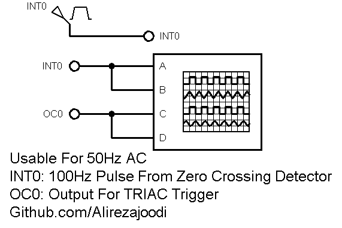

## Triac Trigger Pulse Wit PWM
A PWM pulse synchronized with zero crossing.
 
MCU:        	ATmega32  
Frequency:  	4MHz  
Timer0:		PWM Mode with inverted output
Exite Int0:	Rising Mode
	
Note: INT0 used for end to the timer0 task		

### Folder and Files Description
It has included:
- `Code_CodeVisionAVR` (Code with C Language)
- `Simulate` (Simulator File)

### Simulate: v1.0

My GitHub Account: [GitHub.com/AliRezaJoodi](https://github.com/AliRezaJoodi)  
**Note**: [You can go here to download a single folder or file from GitHub.com](https://minhaskamal.github.io/DownGit/#/home)
