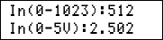
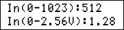
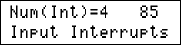
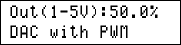
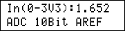
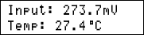
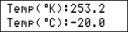
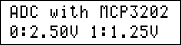
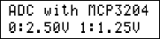

## AVR Programming Exercises

I'm uploading my old files on the repository.

### Gallery of the Repository

 
 
 
 
 

### List of the Repository

|Title|BascomAVR|CodeVisionAVR|mikroC PRO for AVR|
|:----|:-------:|:-----------:|:----------------:|
|[ADC_08Bit_AVCC-VREF](ADC_08Bit_AVCC-VREF)|-|Y|-|
|[ADC_10Bit_AREF-VREF](ADC_10Bit_AREF-VREF)|Y|Y|-|
|[ADC_10Bit_AVCC-VREF](ADC_10Bit_AVCC-VREF)|Y|Y|-|
|[ADC_10Bit_AVCC-VREF_Interrupt](ADC_10Bit_AVCC-VREF_Interrupt)|Y|-|-|
|[ADC_10Bit_Internal-VREF](ADC_10Bit_Internal-VREF)|Y|Y|-|
|[ADC_ExternalADC_MCP3202_SPI](ADC_ExternalADC_MCP3202_SPI)|-|Y|-|
|[ADC_ExternalADC_MCP3204_SPI](ADC_ExternalADC_MCP3204_SPI)|-|Y|-|
|[ATtiny13](ATtiny13)|Y|-|-|
|[BitAccess](BitAccess)|Y|Y|-|
|[Button](Button)|Y|Y|Y|
|[Converter_DataTable](Converter_DataTable)|Y|-|-|
|[Converter_MSB&LSB](Converter_MSB&LSB)|Y|Y|-|
|[DAC_UsingPWM](DAC_UsingPWM)|-|Y|-|
|[Dialing](Dialing)|Y|-|-|
|[Display_7Segment_1Digit](Display_7Segment_1Digit)|Y|Y|-|
|[Display_7Segment_1Digit_Using4026](Display_7Segment_1Digit_Using4026)|Y|Y|-|
|[Display_7Segment_1Digit_Using7447](Display_7Segment_1Digit_Using7447)|Y|Y|-|
|[Display_7Segment_1Digit_Using74164](Display_7Segment_1Digit_Using74164)|Y|Y|-|
|[Display_7Segment_4Digit_2Series](Display_7Segment_4Digit_2Series)|-|Y|-|
|[Display_7Segment_8Digit](Display_7Segment_8Digit)|Y|Y|-|
|[Display_GLCD_KS0108](Display_GLCD_KS0108)|-|Y|-|
|[Display_GLCD_T6963](Display_GLCD_T6963)|Y|-|-|
|[Display_LCD](Display_LCD)|Y|Y|Y|
|[Display_LCD_BarGraph](Display_LCD_BarGraph)|Y|Y|-|
|[Display_LED](Display_LED)|Y|Y|-|
|[Display_LED_Flasher](Display_LED_Flasher)|Y|Y|-|
|[Display_Matrix_8x8](Display_Matrix_8x8)|Y|-|-|
|[EEPROM](EEPROM)|Y|Y|-|
|[Encoder](Encoder)|Y|Y|-|
|[IO_ExternalOutputs_PCF8574_I2C](IO_ExternalOutputs_PCF8574_I2C)|Y|-|-|
|[Include](Include)|Y|Y|-|
|[IO_Input](IO_Input)|Y|-|-|
|[IO_Input_Interrupt](IO_Input_Interrupt)|Y|-|-|
|[IO_Output](IO_Output)|Y|Y|-|
|[IO_PortG&PortF](IO_PortG&PortF)|-|Y|-|
|[Keyboard_PC](Keyboard_PC)|Y|-|-|
|[Keypad_4x3](Keypad_4x3)|Y|Y|-|
|[Keypad_4x4](Keypad_4x4)|Y|Y|-|
|[Keypad_4x4_Using74922](Keypad_4x4_Using74922)|Y|-|-|
|[Keypad_4x4_UsingADC](Keypad_4x4_UsingADC)|Y|-|-|
|[Keypad_4x6](Keypad_4x6)|Y|-|-|
|[Motor_Servo](Motor_Servo)|Y|-|-|
|[Motor_UnipolarStepper](Motor_UnipolarStepper)|Y|-|-|
|[Sensor_Gyroscope&Accelerometer_CMPS10](Sensor_Gyroscope&Accelerometer_CMPS10)|Y|Y|-|
|[Sensor_Gyroscope&Accelerometer_MPU6050](Sensor_Gyroscope&Accelerometer_MPU6050)|Y|-|-|
|[Sensor_LDR](Sensor_LDR)|Y|Y|-|
|[Sensor_Thermometer_LM35](Sensor_Thermometer_LM35)|Y|Y|-|
|[Sensor_Thermometer_LM335](Sensor_Thermometer_LM335)|Y|Y|-|
|[Sound](Sound)|Y|Y|Y|
|[SPI_Config](SPI_Config)|Y|Y|-|
|[SPI_SoftwareSPI](SPI_SoftwareSPI)|Y|-|-|
|[SPI_Interrupt](SPI_Interrupt)|Y|Y|-|
|[String_Syntax](String_Syntax)|Y|Y|-|
|[Timer0_Counter](Timer0_Counter)|Y|-|-|
|[Timer0_Timer](Timer0_Timer)|Y|-|-|
|[Timer1_Counter](Timer1_Counter)|Y|-|-|
|[Timer1_PWM](Timer1_PWM)|Y|Y|-|
|[Timer2_AsyncTimer](Timer2_AsyncTimer)|Y|Y|-|
|[Timer2_Clock&Date](Timer2_Clock&Date)|Y|Y|-|
|[Timer2_PWM](Timer2_PWM)|-|Y|-|
|[UART_BaudRateFinder](UART_BaudRateFinder)|Y|-|-|
|[UART_Config](UART_Config)|Y|Y|-|
|[UART_SoftwareUART](UART_SoftwareUART)|Y|Y|-|
|[UART_Interrupt](UART_Interrupt)|Y|Y|-|
|[VB6_Receiver_Bytes](VB6_Receiver_Bytes)|Y|Y|-|
|[VB6_Receiver_Integer](VB6_Receiver_Integer)|Y|Y|-|
|[VB6_Sender_Byte](VB6_Sender_Byte)|Y|-|-|
|[VB6_Sender_Integer](VB6_Sender_Integer)|Y|-|-|
|[VB6_Sender_Text](VB6_Sender_Text)|Y|-|-|

