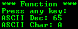

## AVR Programming Exercises

I'm uploading my old files on the repository.

### Gallery of the Repository

### List of the Repository

|Title                              |BascomAVR  |CodeVisionAVR  |mikroC PRO for AVR |
|:----------------------------------|:---------:|:-------------:|:-----------------:|
|ADC_08Bit_AVCC VREF                | -         | Y             | -                 |
|ADC_10Bit_AVCC VREF                | Y         | Y             | -                 |
|ADC_10Bit_AVCC VREF_with Interrupt | Y         | -             | -                 |
|ADC_10Bit_Internal VREF            | Y         | Y             | -                 |
|Access to Bits                     | Y         | -             | -                 |
|Button                             | Y         | Y             | Y                 |
|Data Looking_Syntax                | Y         | -             | -                 |
|Display_LCD_Syntax                 | Y         | Y             | Y                 |
|EEPROM                             | Y         | Y             | -                 |
|Include External Files             | Y         | Y             | -                 |
|IO_Input                           | Y         | -             | -                 |
|IO_Input Interrupts                | Y         | -             | -                 |
|IO_Output                          | Y         | Y             | -                 |
|Keypad_4x3                         | Y         | Y             | -                 |
|Keypad_4x4                         | Y         | Y             | -                 |
|Keypad_4x4_Using 74922             | Y         | -             | -                 |
|Keypad_4x6                         | Y         | -             | -                 |
|Sound                              | Y         | Y             | Y                 |
|String_Syntax                      | Y         | Y             | -                 |
|Timer0_Counter                     | Y         | -             | -                 |
|Timer0_Timer                       | Y         | -             | -                 |
|Timer1_Counter                     | Y         | -             | -                 |
|Timer1_PWM                         | Y         | Y             | -                 |
|Timer2_Async Timer                 | Y         | -             | -                 |
|Timer2_Clock&Date                  | Y         | -             | -                 |
|UART_Software UART                 | Y         | Y             | -                 |
|UART_Syntax                        | Y         | Y             | -                 |
|UART_with Interrupt                | Y         | Y             | -                 |

