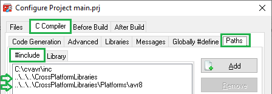

## AVR Programming Exercises
Personal repository for AVR exercise projects.

## Setup: Shared Library 
These exercises use a shared library located in a separate repository:  
[GitHub.com/AliRezaJoodi/CrossPlatformLibraries](https://github.com/AliRezaJoodi/CrossPlatformLibraries)  
To build the projects correctly, both repositories must be cloned inside the same parent directory, side-by-side.  
Example folder structure:  
```
your workspace folder
|-- AVR_Exercises
|-- CrossPlatformLibraries
```

This relative layout is required because the projects use relative paths to access the shared libraries.  
 
Path on the **CodeVisionAVR** is:  
  