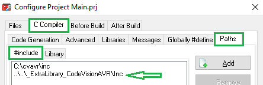
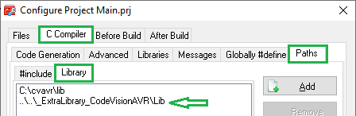

## AVR Programming Exercises
A repository for my personal exercises.

Note: Setting on CodeVision AVR  

Note:  
It uses shared libraries from:  
[CrossPlatformLibraries](https://github.com/AliRezaJoodi/CrossPlatformLibraries)  
Please download and place it in drive C:  
(for example: C:\CrossPlatformLibraries)  

### Table of Contents
|Title|Bascom AVR|CodeVisionAVR|
|:----|:----:|:--------:|
|[Config ADC, Internal VREF, 10Bit Resolution](ADC_2V56_10Bit)							|Y|Y|
|[Config ADC, AREF VREF, 10Bit Resolution](ADC_AREF_10Bit)							|Y|Y|
|[Config ADC, AVCC VREF, 8Bit Resolution](ADC_AVCC_08Bit)							|-|Y|
|[Config ADC, AVCC VREF, 10Bit Resolution](ADC_AVCC_10Bit)							|Y|Y|
|[Config ADC, AVCC VREF, 10Bit Resolution, Interrupt](ADC_AVCC_10Bit_Interrupt)					|Y|Y|
|[External ADC With SPI Interface, MCP3201](ADC_ExternalWithSPI_MCP3201)					|-|Y|
|[External ADC With SPI Interface, MCP3202](ADC_ExternalWithSPI_MCP3202)					|-|Y|
|[External ADC With SPI Interface, MCP3204](ADC_ExternalWithSPI_MCP3204)					|-|Y|
|[External ADC With SPI Interface, MCP3208](ADC_ExternalWithSPI_MCP3208)					|-|Y|
|[ATtiny13](ATtiny13)												|Y|-|
|[Average](Average)												|-|Y|
|[Access to a bit from a byte](BitAccess)									|Y|Y|
|[Button](Button)												|Y|Y|
|[Buzzer](Buzzer)												|Y|Y|
|[Calendar Converter](CalendarConverter)									|-|Y|
|[Chronometer](Chronometer)											|Y|-|
|[On/Off Control Systems](ControlSystems_OnOff)									|-|Y|
|[PID Control Systems](ControlSystems_PID)									|-|Y|
|[PID Control Systems With On/Off Mode](ControlSystems_PID_OnOffMode)						|-|Y|
|[Data Table Converter](Converter_DataTable)									|Y|-|
|[MSB & LSB Converter](Converter_MSB&LSB)									|Y|Y|
|[Counter For Used Clock](CounterForUsedClock)									|-|Y|
|[External DAC With SPI Interface, MCP4822](DAC_ExternalWithSPI_MCP4822)					|-|Y|
|[DAC With PWM and RC](DAC_WithPWM)										|-|Y|
|[Dialing](Dialing)												|Y|-|
|[7-Segment Display For 1Digit](Display_7Segment_1Digit)							|Y|Y|
|[7-Segment Display For 1Digit With 4026](Display_7Segment_1Digit_4026)						|Y|Y|
|[7-Segment Display For 1Digit With 7447](Display_7Segment_1Digit_7447)						|Y|Y|
|[7-Segment Display For 1Digit With 74164](Display_7Segment_1Digit_74164)					|Y|Y|
|[7-Segment Display For 4Digit,Two Displays](Display_7Segment_4Digit_2Display)					|-|Y|
|[7-Segment Display For 8Digit](Display_7Segment_8Digit)							|Y|Y|
|[KS0108 GLCD Display](Display_GLCD_KS0108)									|-|Y|
|[T6963 GLCD Display](Display_GLCD_T6963)									|Y|-|
|[LCD Display](Display_LCD)											|Y|Y|
|[BarGraph Display On LCD](Display_LCD_BarGraph)								|Y|Y|
|[Billboard With LCD Display](Display_LCD_Billboard)								|Y|-|
|[Create Menu On LCD Display](Display_LCD_Menu)									|-|Y|
|[LED Display](Display_LED)											|Y|Y|
|[Flasher With LED](Display_LED_Flasher)									|Y|Y|
|[RGB LED](Display_LED_RGB)											|Y|-|
|[8x8 Dot Matrix Display](Display_Matrix_8x8)									|Y|-|
|[Internal EEPROM](EEPROM)											|Y|Y|
|[Encoder](Encoder)												|Y|Y|
|[Frequency Meter, Timer0, 0.1S, 4MHz](FrequencyMeter_Timer0_0.1S_4MHz)						|-|Y|
|[FrequencyMeter, Timer0, 1S, 11.059200MHz](FrequencyMeter_Timer0_1S_11.059200MHz)				|Y|-|
|[FrequencyMeter, Timer0, 1S, 11.059200MHz, 7Segment Display](FrequencyMeter_Timer0_1S_11.059200MHz_7Segment)	|Y|-|
|[Add External File In Code](Include)										|Y|Y|
|[Digital Input](IO_Input)											|Y|-|
|[External Interrupt INT0](Interrupt_INT0)									|Y|Y|
|[External Interrupt INT1](Interrupt_INT1)									|Y|Y|
|[External Interrupt INT2](Interrupt_INT2)									|Y|Y|
|[External Output With I2C Interface, PCF8574](IO_ExternalOutputWithI2C_PCF8574)				|Y|-|
|[Digital Output](IO_Output)											|Y|Y|
|[Use of PortG & PortF](IO_PortG&PortF)										|-|Y|
|[PC Keyboard](Keyboard_PC)											|Y|-|
|[4x3 Keypad](Keypad_4x3)											|Y|Y|
|[4x4 Keypad](Keypad_4x4)											|Y|Y|
|[4x4 Keypad With 74922](Keypad_4x4_74922)									|Y|-|
|[4x4 Keypad With ADC](Keypad_4x4_ADC)										|Y|-|
|[4x6 Keypad](Keypad_4x6)											|Y|-|
|[DC Motor](Motor_DC)												|Y|-|
|[Servo Motor](Motor_Servo)											|Y|-|
|[Unipolar Stepper Motor](Motor_UnipolarStepper)								|Y|-|
|[PWM and Frequency Controlled, Maximum to 31.250KHz](PulseGenerator_PWM&FrequencyControlled)			|-|Y|
|[PWM Generator With Customize Channel](PulseGenerator_PWMwithCustomizeChannel)					|Y|-|
|[TRIAC Trigger Pulse with PWM](PulseGenerator_TriacTriggerPulseWithPWM)					|-|Y|
|[1CH Relay Controller With UART](RelayController_UART_1CH)							|Y|-|
|[8CH Relay Controller With UART](RelayController_UART_8CH)							|Y|-|
|[External RTC with DS1307 For I2C Bus](RTC_DS1307)								|Y|Y|
|[Gyroscope and Accelerometer With I2C Interfac, CMPS10](Sensor_GyroscopeWithI2C_CMPS10)			|Y|Y|
|[Gyroscope And Accelerometer With I2C Interface, MPU6050](Sensor_GyroscopeWithI2C_MPU6050)			|Y|-|
|[Humidity Sensor With SHT10](Sensor_Humidity_SHT10)								|Y|Y|
|[LDR Sensor](Sensor_LDR)											|Y|Y|
|[100K NTC Sensor](Sensor_NTC_100K)										|-|Y|
|[Temperature Sensor With DS18B20](Sensor_Temperature_DS18B20)							|Y|Y|
|[Temperature Sensor With DS18B20, 4Sensors](Sensor_Temperature_DS18B20_4Sensors)				|Y|Y|
|[Temperature Sensor With LM35](Sensor_Temperature_LM35)							|Y|Y|
|[Temperature Sensor With LM335](Sensor_Temperature_LM335)							|Y|Y|
|[Temperature Sensor With SMT160](Sensor_Temperature_SMT160)							|Y|-|
|[Thermocouple Sensor With TypeK](Sensor_Thermocouple_TypeK)							|-|Y|
|[Music Player](Sound_MusicPlayer)										|Y|-|
|[Config SPI](SPI_Config)											|Y|Y|
|[Config Software SPI](SPI_SoftwareSPI)										|Y|-|
|[Config SPI With Interrupt](SPI_Interrupt)									|Y|Y|
|[String Syntax](String_Syntax)											|Y|Y|
|[Config Timer0 in Counter Mode](Timer0_Counter)								|Y|Y|
|[Config Timer0 in CTC Mode](Timer0_CTC)									|-|Y|
|[Config Timer0 in PWM Mode](Timer0_PWM)									|-|Y|
|[Config Timer0 in Timer Mode](Timer0_Timer)									|Y|Y|
|[Config Timer1 in Counter Mode](Timer1_Counter)								|Y|Y|
|[Config Timer1 in CTC Mode](Timer1_CTC)									|-|Y|
|[Config Timer1 in PWM Mode](Timer1_PWM)									|Y|Y|
|[Config Timer1 in Timer Mode](Timer1_Timer)									|-|Y|
|[Config Timer2 in AsyncTimer Mode](Timer2_AsyncTimer)								|Y|Y|
|[Clock & Date With Timer2](Timer2_Clock&Date)									|Y|Y|
|[Config Timer2 in CTC Mode](Timer2_CTC)									|-|Y|
|[Config Timer2 in PWM Mode](Timer2_PWM)									|-|Y|
|[Config Timer2 in Timer Mode](Timer2_Timer)									|-|Y|
|[Baud Rate Finder In UART](UART_BaudRateFinder)								|Y|-|
|[Config UART](UART_Config)											|Y|Y|
|[Config Software UART](UART_SoftwareUART)									|Y|Y|
|[Config UART With Interrupt](UART_Interrupt)									|Y|Y|
|[VB6_Receiver_Bytes](VB6_Receiver_Bytes)									|Y|Y|
|[VB6_Receiver_Integer](VB6_Receiver_Integer)									|Y|Y|
|[VB6_Sender_Byte](VB6_Sender_Byte)										|Y|-|
|[VB6_Sender_Integer](VB6_Sender_Integer)									|Y|-|
|[VB6_Sender_Text](VB6_Sender_Text)										|Y|-|
|[Watchdog](Watchdog)												|-|Y|

