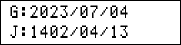
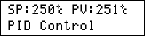
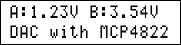
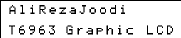
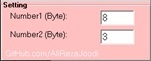

## AVR Programming Exercises
A repository for my personal exercises.

1: Bascom AVR  
2: CodeVision AVR  
3: mikroC PRO for AVR 

### Table of Contents
|Picture|Title|1|2|3|
|:------|:----|:----:|:--------:|:----:|
||[Config ADC, 8Bit Resolution, AVCC VREF](ADC_08Bit_AVCC)|-|Y|-|
||[Config ADC, 10Bit Resolution, Internal VREF](ADC_10Bit_2V56)|Y|Y|-|
||[Config ADC, 10Bit Resolution, AREF VREF](ADC_10Bit_AREF)|Y|Y|-|
||[Config ADC, 10Bit Resolution, AVCC VREF](ADC_10Bit_AVCC)|Y|Y|-|
||[Config ADC, 10Bit Resolution, AVCC VREF, Interrupt](ADC_10Bit_AVCC_Interrupt)|Y|-|-|
||[External ADC With MCP320x On SPI Bus](ADC_ExternalADC_MCP320x_SPI)|-|Y|-|
||[ATtiny13](ATtiny13)|Y|-|-|
||[Average](Average)|-|Y|-|
||[Access to a bit from a byte](BitAccess)|Y|Y|-|
||[Button](Button)|Y|Y|Y|
||[Buzzer](Buzzer)|Y|Y|Y|
||[Calendar Converter](CalendarConverter)|-|Y|-|
||[Chronometer](Chronometer)|Y|-|-|
||[On/Off Control Systems](ControlSystems_OnOff)|-|Y|-|
||[PID Control Systems](ControlSystems_PID)|-|Y|-|
||[PID Control Systems With On/Off Mode](ControlSystems_PID_OnOffMode)|-|Y|-|
||[Data Table Converter](Converter_DataTable)|Y|-|-|
||[MSB & LSB Converter](Converter_MSB&LSB)|Y|Y|-|
||[Counter For Used Clock](CounterForUsedClock)|-|Y|-|
||[External DAC With MCP4822 On SPI Bus](DAC_ExternalDAC_MCP4822_SPI)|-|Y|-|
||[DAC With PWM and RC](DAC_WithPWM)|-|Y|-|
||[Dialing](Dialing)|Y|-|-|
||[7-Segment Display For 1Digit](Display_7Segment_1Digit)|Y|Y|-|
||[7-Segment Display For 1Digit With 4026](Display_7Segment_1Digit_4026)|Y|Y|-|
||[7-Segment Display For 1Digit With 7447](Display_7Segment_1Digit_7447)|Y|Y|-|
||[7-Segment Display For 1Digit With 74164](Display_7Segment_1Digit_74164)|Y|Y|-|
||[7-Segment Display For 4Digit,Two Displays](Display_7Segment_4Digit_2Display)|-|Y|-|
||[7-Segment Display For 8Digit](Display_7Segment_8Digit)|Y|Y|-|
||[KS0108 GLCD Display](Display_GLCD_KS0108)|-|Y|-|
||[T6963 GLCD Display](Display_GLCD_T6963)|Y|-|-|
||[LCD Display](Display_LCD)|Y|Y|Y|
||[BarGraph Display On A LCD](Display_LCD_BarGraph)|Y|Y|-|
||[Billboard With LCD Display](Display_LCD_Billboard)|Y|-|-|
||[Create Menu On LCD Display](Display_LCD_Menu)|-|Y|-|
||[LED Display](Display_LED)|Y|Y|-|
||[Flasher With LED](Display_LED_Flasher)|Y|Y|-|
||[RGB LED](Display_LED_RGB)|Y|-|-|
||[8x8 Dot Matrix Display](Display_Matrix_8x8)|Y|-|-|
||[Internal EEPROM](EEPROM)|Y|Y|-|
||[Encoder](Encoder)|Y|Y|-|
||[Frequency Meter, Timer0, 0.1S, 4MHz](FrequencyMeter_Timer0_0.1S_4MHz)|-|Y|-|
||[FrequencyMeter, Timer0, 1S, 11.059200MHz](FrequencyMeter_Timer0_1S_11.059200MHz)|Y|-|-|
||[FrequencyMeter, Timer0, 1S, 11.059200MHz, 7Segment Display](FrequencyMeter_Timer0_1S_11.059200MHz_7Segment)|Y|-|-|
||[External Outputs With PCF8574 On I2C Bus](IO_ExternalOutputs_PCF8574_I2C)|Y|-|-|
||[Add External File In Code](Include)|Y|Y|-|
||[Digital Input](IO_Input)|Y|-|-|
||[External Interrupt INT0](Interrupt_INT0)|Y|Y|-|
||[External Interrupt INT1](Interrupt_INT1)|Y|Y|-|
||[External Interrupt INT2](Interrupt_INT2)|Y|Y|-|
||[Digital Output](IO_Output)|Y|Y|-|
||[Use of PortG & PortF](IO_PortG&PortF)|-|Y|-|
||[PC Keyboard](Keyboard_PC)|Y|-|-|
||[4x3 Keypad](Keypad_4x3)|Y|Y|-|
||[4x4 Keypad](Keypad_4x4)|Y|Y|-|
||[4x4 Keypad With 74922](Keypad_4x4_74922)|Y|-|-|
||[4x4 Keypad With ADC](Keypad_4x4_ADC)|Y|-|-|
||[4x6 Keypad](Keypad_4x6)|Y|-|-|
||[DC Motor](Motor_DC)|Y|-|-|
||[Servo Motor](Motor_Servo)|Y|-|-|
||[Unipolar Stepper Motor](Motor_UnipolarStepper)|Y|-|-|
||[PWM and Frequency Controlled, Maximum to 31.250KHz](PulseGenerator_PWM&FrequencyControlled_31.250KHz)|-|Y|-|
||[PWM Generator With Customize Channel](PulseGenerator_PWMwithCustomizeChannel)|Y|-|-|
||[TRIAC Trigger Pulse with PWM](PulseGenerator_TriacTriggerPulseWithPWM)|-|Y|-|
||[1CH Relay Controller With UART](RelayController_UART_1CH)|Y|-|-|
||[8CH Relay Controller With UART](RelayController_UART_8CH)|Y|-|-|
||[External RTC with DS1307 For I2C Bus](RTC_DS1307)|Y|Y|-|
||[Gyroscope and Accelerometer With CMPS10](Sensor_Gyroscope&Accelerometer_CMPS10)|Y|Y|-|
||[Gyroscope and Accelerometer With MPU6050](Sensor_Gyroscope&Accelerometer_MPU6050)|Y|-|-|
||[Humidity Sensor With SHT10](Sensor_Humidity_SHT10)|Y|Y|-|
||[LDR Sensor](Sensor_LDR)|Y|Y|-|
||[Temperature Sensor With DS18B20](Sensor_Temperature_DS18B20)|Y|Y|-|
||[Temperature Sensor With DS18B20, 4Sensors](Sensor_Temperature_DS18B20_4Sensors)|Y|Y|-|
||[Temperature Sensor With LM35](Sensor_Temperature_LM35)|Y|Y|-|
||[Temperature Sensor With LM335](Sensor_Temperature_LM335)|Y|Y|-|
||[Temperature Sensor With SMT160](Sensor_Temperature_SMT160)|Y|-|-|
||[Thermocouple Sensor With TypeK](Sensor_Thermocouple_TypeK)|-|Y|-|
||[Music Player](Sound_MusicPlayer)|Y|-|-|
||[Config SPI](SPI_Config)|Y|Y|-|
||[Config Software SPI](SPI_SoftwareSPI)|Y|-|-|
||[Interrupt In SPI](SPI_Interrupt)|Y|Y|-|
||[String Syntax](String_Syntax)|Y|Y|-|
||[Config Timer0 in Counter Mode](Timer0_Counter)|Y|Y|-|
||[Config Timer0 in CTC Mode](Timer0_CTC)|-|Y|-|
||[Config Timer0 in PWM Mode](Timer0_PWM)|-|Y|-|
||[Config Timer0 in Timer Mode](Timer0_Timer)|Y|Y|-|
||[Config Timer1 in Counter Mode](Timer1_Counter)|Y|Y|-|
||[Config Timer1 in CTC Mode](Timer1_CTC)|-|Y|-|
||[Config Timer1 in PWM Mode](Timer1_PWM)|Y|Y|-|
||[Config Timer1 in Timer Mode](Timer1_Timer)|-|Y|-|
||[Config Timer2 in AsyncTimer Mode](Timer2_AsyncTimer)|Y|Y|-|
||[Clock & Date With Timer2](Timer2_Clock&Date)|Y|Y|-|
||[Config Timer2 in CTC Mode](Timer2_CTC)|-|Y|-|
||[Config Timer2 in PWM Mode](Timer2_PWM)|-|Y|-|
||[Config Timer2 in Timer Mode](Timer2_Timer)|-|Y|-|
||[Baud Rate Finder In UART](UART_BaudRateFinder)|Y|-|-|
||[Config UART](UART_Config)|Y|Y|-|
||[Config Software UART](UART_SoftwareUART)|Y|Y|-|
||[Interrupt In UART](UART_Interrupt)|Y|Y|-|
||[VB6_Receiver_Bytes](VB6_Receiver_Bytes)|Y|Y|-|
||[VB6_Receiver_Integer](VB6_Receiver_Integer)|Y|Y|-|
||[VB6_Sender_Byte](VB6_Sender_Byte)|Y|-|-|
| |[VB6_Sender_Integer](VB6_Sender_Integer)|Y|-|-|
| |[VB6_Sender_Text](VB6_Sender_Text)|Y|-|-|
||[Watchdog](Watchdog)|-|Y|-|

