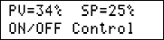

## AVR Programming Exercises
A repository for my personal exercises.

### Gallery of the Repository

 
 
 
 
 

1: Bascom AVR  
2: CodeVision AVR  
3: mikroC PRO for AVR 

### Table of Contents
|Picture|Title|1|2|3|
|:------|:----|:----:|:--------:|:----:|
||[ADC_08Bit_AVCC-VREF](ADC_08Bit_AVCC-VREF)|-|Y|-|
||[ADC_10Bit_AREF-VREF](ADC_10Bit_AREF-VREF)|Y|Y|-|
||[ADC_10Bit_AVCC-VREF](ADC_10Bit_AVCC-VREF)|Y|Y|-|
||[ADC_10Bit_AVCC-VREF_Interrupt](ADC_10Bit_AVCC-VREF_Interrupt)|Y|-|-|
||[ADC_10Bit_Internal-VREF](ADC_10Bit_Internal-VREF)|Y|Y|-|
||[ADC_ExternalADC_MCP320x_SPI](ADC_ExternalADC_MCP320x_SPI)|-|Y|-|
||[ATtiny13](ATtiny13)|Y|-|-|
||[Average](Average)|-|Y|-|
||[BitAccess](BitAccess)|Y|Y|-|
||[Button](Button)|Y|Y|Y|
||[Buzzer](Buzzer)|Y|Y|Y|
||[CalendarConverter](CalendarConverter)|-|Y|-|
||[Chronometer](Chronometer)|Y|-|-|
||[ControlSystems_OnOff](ControlSystems_OnOff)|-|Y|-|
||[ControlSystems_PID](ControlSystems_PID)|-|Y|-|
||[ControlSystems_PID-OnOFF](ControlSystems_PID-OnOFF)|-|Y|-|
||[Converter_DataTable](Converter_DataTable)|Y|-|-|
||[Converter_MSB&LSB](Converter_MSB&LSB)|Y|Y|-|
||[CounterForUsedClock](CounterForUsedClock)|-|Y|-|
||[DAC_ExternalDAC_MCP4822_SPI](DAC_ExternalDAC_MCP4822_SPI)|-|Y|-|
||[DAC_WithPWM](DAC_WithPWM)|-|Y|-|
||[Dialing](Dialing)|Y|-|-|
||[Display_7Segment_1Digit](Display_7Segment_1Digit)|Y|Y|-|
||[Display_7Segment_1Digit_Using4026](Display_7Segment_1Digit_Using4026)|Y|Y|-|
||[Display_7Segment_1Digit_Using7447](Display_7Segment_1Digit_Using7447)|Y|Y|-|
||[Display_7Segment_1Digit_Using74164](Display_7Segment_1Digit_Using74164)|Y|Y|-|
||[Display_7Segment_4Digit_2Display](Display_7Segment_4Digit_2Display)|-|Y|-|
||[Display_7Segment_8Digit](Display_7Segment_8Digit)|Y|Y|-|
||[Display_GLCD_KS0108](Display_GLCD_KS0108)|-|Y|-|
||[Display_GLCD_T6963](Display_GLCD_T6963)|Y|-|-|
||[Display_LCD](Display_LCD)|Y|Y|Y|
||[Display_LCD_BarGraph](Display_LCD_BarGraph)|Y|Y|-|
||[Display_LCD_BulletinBoard](Display_LCD_BulletinBoard)|Y|-|-|
||[Display_LCD_Menu](Display_LCD_Menu)|-|Y|-|
||[Display_LED](Display_LED)|Y|Y|-|
||[Display_LED_Flasher](Display_LED_Flasher)|Y|Y|-|
||[Display_LED_RGB](Display_LED_RGB)|Y|-|-|
||[Display_Matrix_8x8](Display_Matrix_8x8)|Y|-|-|
||[EEPROM](EEPROM)|Y|Y|-|
||[Encoder](Encoder)|Y|Y|-|
||[FrequencyMeter_Timer0_0.1S_4MHz](FrequencyMeter_Timer0_0.1S_4MHz)|-|Y|-|
||[FrequencyMeter_Timer0_1S_11.059200MHz](FrequencyMeter_Timer0_1S_11.059200MHz)|Y|-|-|
||[FrequencyMeter_Timer0_1S_11.059200MHz_7Segment](FrequencyMeter_Timer0_1S_11.059200MHz_7Segment)|Y|-|-|
||[IO_ExternalOutputs_PCF8574_I2C](IO_ExternalOutputs_PCF8574_I2C)|Y|-|-|
||[Include](Include)|Y|Y|-|
||[IO_Input](IO_Input)|Y|-|-|
||[IO_Input_Interrupt](IO_Input_Interrupt)|Y|-|-|
||[IO_Output](IO_Output)|Y|Y|-|
||[IO_PortG&PortF](IO_PortG&PortF)|-|Y|-|
||[Keyboard_PC](Keyboard_PC)|Y|-|-|
||[Keypad_4x3](Keypad_4x3)|Y|Y|-|
||[Keypad_4x4](Keypad_4x4)|Y|Y|-|
||[Keypad_4x4_Using74922](Keypad_4x4_Using74922)|Y|-|-|
||[Keypad_4x4_UsingADC](Keypad_4x4_UsingADC)|Y|-|-|
||[Keypad_4x6](Keypad_4x6)|Y|-|-|
||[Motor_DC](Motor_DC)|Y|-|-|
||[Motor_Servo](Motor_Servo)|Y|-|-|
||[Motor_UnipolarStepper](Motor_UnipolarStepper)|Y|-|-|
||[PWM_CustomMadeChannels](PWM_CustomMadeChannels)|Y|-|-|
||[RelayController_UART_1CH](RelayController_UART_1CH)|Y|-|-|
||[RelayController_UART_8CH](RelayController_UART_8CH)|Y|-|-|
||[RTC_DS1307](RTC_DS1307)|-|Y|-|
||[Sensor_Gyroscope&Accelerometer_CMPS10](Sensor_Gyroscope&Accelerometer_CMPS10)|Y|Y|-|
||[Sensor_Gyroscope&Accelerometer_MPU6050](Sensor_Gyroscope&Accelerometer_MPU6050)|Y|-|-|
||[Sensor_Humidity_SHT10](Sensor_Humidity_SHT10)|Y|Y|-|
||[Sensor_LDR](Sensor_LDR)|Y|Y|-|
||[Sensor_Temperature_DS18B20](Sensor_Temperature_DS18B20)|Y|Y|-|
||[Sensor_Temperature_DS18B20_4Sensors](Sensor_Temperature_DS18B20_4Sensors)|Y|Y|-|
||[Sensor_Temperature_LM35](Sensor_Temperature_LM35)|Y|Y|-|
||[Sensor_Temperature_LM335](Sensor_Temperature_LM335)|Y|Y|-|
||[Sensor_Temperature_SMT160](Sensor_Temperature_SMT160)|Y|-|-|
||[Sensor_Thermocouple_TypeK](Sensor_Thermocouple_TypeK)|-|Y|-|
||[Sound_MusicPlayer](Sound_MusicPlayer)|Y|-|-|
||[SPI_Config](SPI_Config)|Y|Y|-|
||[SPI_SoftwareSPI](SPI_SoftwareSPI)|Y|-|-|
||[SPI_Interrupt](SPI_Interrupt)|Y|Y|-|
||[String_Syntax](String_Syntax)|Y|Y|-|
||[Timer0_Counter](Timer0_Counter)|Y|-|-|
||[Timer0_Timer](Timer0_Timer)|Y|-|-|
||[Timer1_Counter](Timer1_Counter)|Y|-|-|
||[Timer1_PWM](Timer1_PWM)|Y|Y|-|
||[Timer2_AsyncTimer](Timer2_AsyncTimer)|Y|Y|-|
||[Timer2_Clock&Date](Timer2_Clock&Date)|Y|Y|-|
||[Timer2_PWM](Timer2_PWM)|-|Y|-|
||[UART_BaudRateFinder](UART_BaudRateFinder)|Y|-|-|
||[UART_Config](UART_Config)|Y|Y|-|
||[UART_SoftwareUART](UART_SoftwareUART)|Y|Y|-|
||[UART_Interrupt](UART_Interrupt)|Y|Y|-|
||[VB6_Receiver_Bytes](VB6_Receiver_Bytes)|Y|Y|-|
||[VB6_Receiver_Integer](VB6_Receiver_Integer)|Y|Y|-|
||[VB6_Sender_Byte](VB6_Sender_Byte)|Y|-|-|
| |[VB6_Sender_Integer](VB6_Sender_Integer)|Y|-|-|
| |[VB6_Sender_Text](VB6_Sender_Text)|Y|-|-|
||[Watchdog](Watchdog)|-|Y|-|

