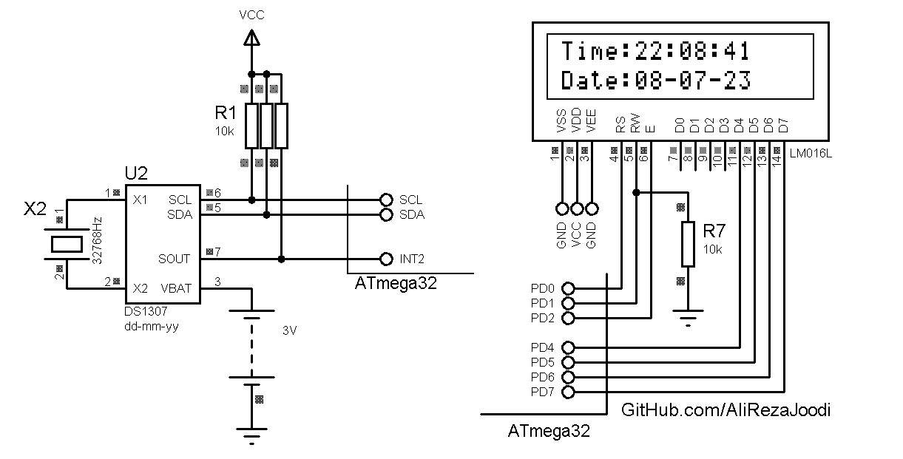

## External RTC with DS1307 For I2C-Bus 
                
MCU:   		ATmega32  
Frequency:     	8MHz  

### Folder and Files Description
It has included:
- `Code_BascomAVR_I2C` (Code with Basic Language, Software Library For I2C)
- `Code_CodeVisionAVR_I2C` (Code with C Language, Software Library For I2C)
- `Code_CodeVisionAVR_TWI` (Code with C Language, Hardware Library For TWI)
- `Simulate` (Simulator File)

### Simulate: v1.0

My GitHub Account: [GitHub.com/AliRezaJoodi](https://github.com/AliRezaJoodi)  
**Note**: [You can go here to download a single folder or file from GitHub.com](https://minhaskamal.github.io/DownGit/#/home)
