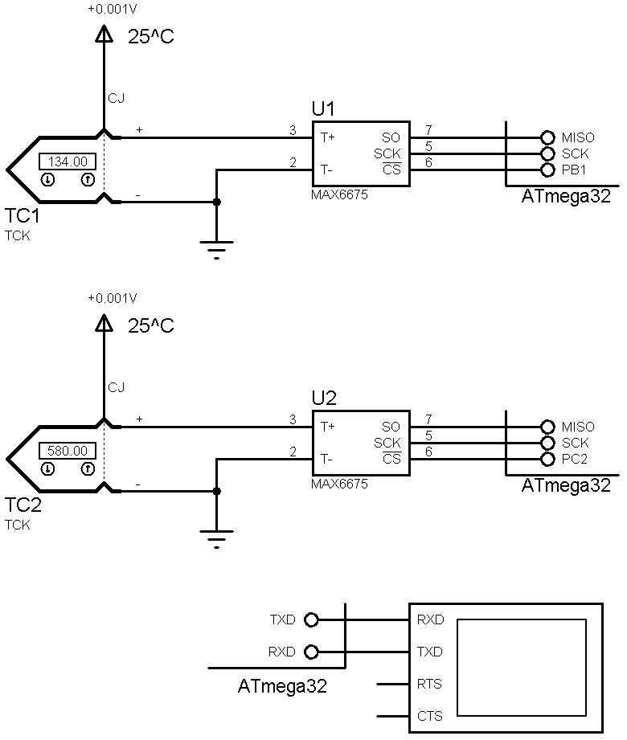

## MAX6675
Test my library from CrossPlatformLibraries.  

### Simulate: v1.0

### Features 
- **MCU:** ATmega32A 
- **Display:** UART
- **Thermocouple:** Type-K x2                  

Note:  
In Proteus, the values of two MAX6675 sensors may appear swapped.    
This is not a firmware or driver issue; it is a Proteus simulation/model limitation.  

### Folders and Files
- `Code_CodeVisionAVR` (Code with C Language)
- `Simulate` (Simulator File)

### Useful Links
GitHub Profile:  
[GitHub.com/AliRezaJoodi](https://github.com/AliRezaJoodi)   
Download single folder or file from GitHub:  
[https://minhaskamal.github.io/DownGit/#/home](https://minhaskamal.github.io/DownGit/#/home)  
