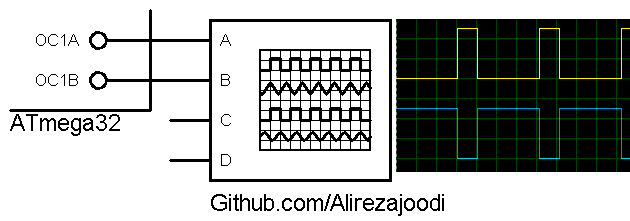

## Config Timer1 in PWM Mode

MCU:        ATmega32  
Frequency:  8MHz  

The PWM frequency for the output can be calculated by the following equation:

$$ FrequencyForPWM(OC1x) = {clk \over Prescaler * (1+TOP) } $$

Prescaler: 1, 8, 64, 256 or 1024  
TOP: 0x00FF, 0x01FF or 0x03FF  

### Folder and Files Description
It has included:
- `Code_BascomAVR` (Code with Basic Language)
- `Code_CodeVisionAVR` (Code with C Language)
- `Simulate` (Simulator File)

### Simulate: v1.0

My GitHub Account: [GitHub.com/AliRezaJoodi](https://github.com/AliRezaJoodi)  
**Note**: [You can go here to download a single folder or file from GitHub.com](https://minhaskamal.github.io/DownGit/#/home)
