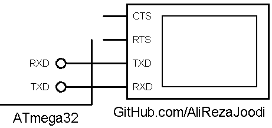

## Integer to MSB and LSB Converter

### Simulate: v1.0

MCU:            ATmega32    

### Folder and Files Description
- `Code_CodeVisionAVR` (Code with C Language)
- `Simulate` (Simulator File)

My GitHub Account: [GitHub.com/AliRezaJoodi](https://github.com/AliRezaJoodi)  
**Note**: [You can go here to download a single folder or file from GitHub.com](https://minhaskamal.github.io/DownGit/#/home)
