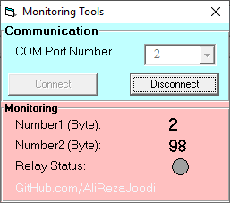
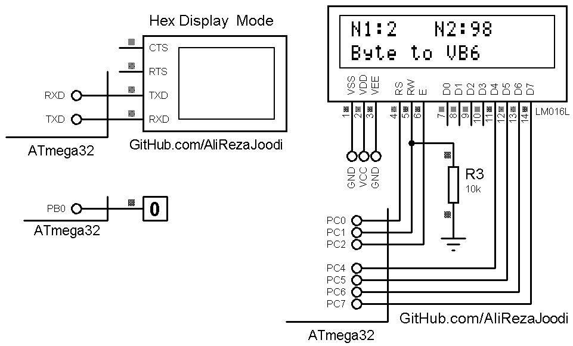

## VB6 Coding for Receive Byte Data Type from MCU

MCU:        ATmega32  
Frequency:  11.059200 MHz     
Interface:  UART

Note: RS232 to UART and USB to UART converter is usable for connection the project to computer.

### Folder and Files Description
It has included:
- `Code_BascomAVR` (Code with Basic Language)
- `Code_CodeVisionAVR` (Code with C Language)
- `Code_VB6` (Software with Visual Basic)
- `Simulate` (Simulator File)

### Software: v1.0

### Simulate: v1.0

My GitHub Account: [GitHub.com/AliRezaJoodi](https://github.com/AliRezaJoodi)  
**Note**: [You can go here to download a single folder or file from GitHub.com](https://minhaskamal.github.io/DownGit/#/home)
