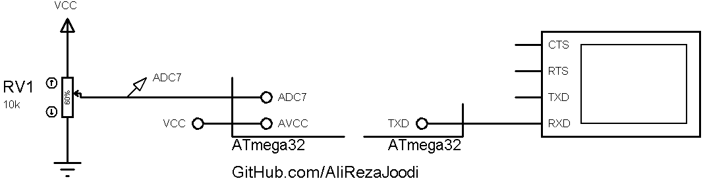

## Change Detector, Static
 
MCU:		ATmega32  
Display:    	UART 

### Simulate
v1.0  

My GitHub Account: [GitHub.com/AliRezaJoodi](https://github.com/AliRezaJoodi)  
**Note**: [You can go here to download a single folder or file from GitHub.com](https://minhaskamal.github.io/DownGit/#/home)
